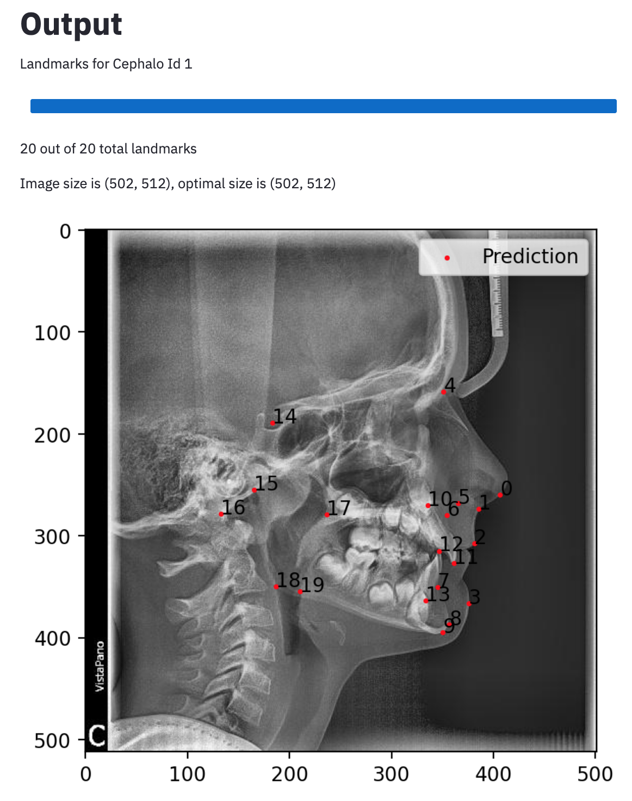

# Cephalometric Landmarks

Web application to predict 20 cephalometric landmarks on a user's x-ray image.

Built as part of the Computer Vision Lab ([github](https://github.com/WUT-ML), [website](https://cvlab.ii.pw.edu.pl/)) at [WUT](https://www.pw.edu.pl/engpw) and [Department of Maxillofacial Orthopaedics and Orthodontics](http://www.ortodoncja.ump.edu.pl/klinika/index.php?lng=en) at [PUMS](https://pums.ump.edu.pl/).

Built with the help of [Foveated Pyramid](https://github.com/logangilmour/FoveatedPyramid), [Streamlit](https://streamlit.io/) and [FastAPI template](https://github.com/tiangolo/full-stack-fastapi-postgresql).

# Running the project
1. `git clone https://github.com/enymuss/cephalo-landmarks`
2. `cd cephalo-landmarks`
3. Place the `.env` file here.
4. `docker-compose up -d`
